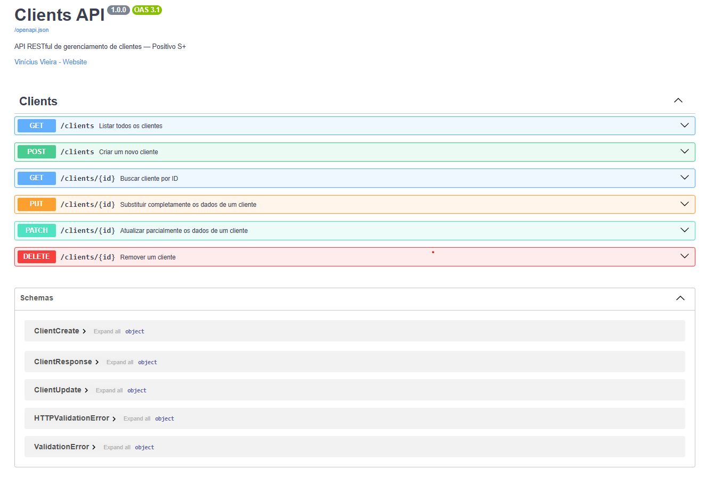

<div align="center">

# Clients API

**API RESTful de gerenciamento de clientes — Positivo S+ Technical Challenge**

[](https://www.python.org/)
[](https://fastapi.tiangolo.com/)
[](https://www.mongodb.com/)
[](https://motor.readthedocs.io/)
[](https://docs.pydantic.dev/)
[](https://docs.docker.com/compose/)
[](https://pytest.org/)
[](LICENSE)

_API CRUD em camadas, pronta para produção. Do zero ao Swagger UI rodando em menos de 2 minutos._


</div>

---

## Índice

- [Visão Geral](#visão-geral)
- [Funcionalidades](#funcionalidades)
- [Tech Stack](#tech-stack)
- [Arquitetura do Projeto](#arquitetura-do-projeto)
- [Quickstart](#quickstart)
- [Desenvolvimento Local](#desenvolvimento-local)
  - [Pré-requisitos](#pré-requisitos)
  - [Clone & Configuração](#clone--configuração)
  - [Variáveis de Ambiente](#variáveis-de-ambiente)
  - [Executando com Docker Compose](#executando-com-docker-compose)
  - [Executando Localmente (venv)](#executando-localmente-venv)
- [Referência da API](#referência-da-api)
  - [Endpoints](#endpoints)
  - [Modelo de Dados do Cliente](#modelo-de-dados-do-cliente)
  - [Códigos de Erro HTTP](#códigos-de-erro-http)
- [Testes](#testes)
- [Estrutura do Projeto](#estrutura-do-projeto)
- [Uso de IA](#uso-de-ia)
- [Solução de Problemas](#solução-de-problemas)
- [Licença](#licença)

---

## Visão Geral

API REST assíncrona completa construída sobre **FastAPI + MongoDB** com estrita separação de responsabilidades em quatro camadas: Middleware → Router → Service → Repository. Cada decisão de design prioriza a corretude: códigos de status HTTP semânticos, imposição de unique index no nível do banco de dados, I/O puramente assíncrono e um Swagger UI completamente autodocumentado que funciona como um harness de testes completo.

> [!TIP]
> O stack completo inicializa com um único comando. Sem Python local, sem instalação do MongoDB, sem configuração manual — apenas Docker.

---

## Funcionalidades

- **CRUD completo** — `POST`, `GET`, `PUT`, `PATCH`, `DELETE` com semântica HTTP correta por operação
- **Health check** — `GET /health` verifica conectividade com o MongoDB em tempo real; retorna `{"status":"ok","database":"ok"}` ou `503` quando o banco está inacessível
- **Validação de documentos** — Formato de CPF e CNPJ aplicado via `@field_validator` com regex (apenas formato, sem cálculo de dígito verificador)
- **Imposição de unique index** — Indexes de `email` e `document` criados programaticamente na inicialização; duplicatas retornam `409 Conflict` com o campo conflitante identificado
- **Tratamento semântico de ObjectId** — Todos os valores `_id` convertidos para string `id` em cada resposta; IDs malformados retornam `400 Bad Request`
- **Async do início ao fim** — Driver async Motor 3.4; o event loop do FastAPI nunca bloqueia em I/O
- **Request logging estruturado** — Cada requisição logada com método, path, status code e tempo de resposta (ms)
- **Inicialização zero-config** — `docker compose up --build` conecta API + MongoDB em uma rede Docker interna

---

## Tech Stack

| Camada         | Tecnologia               | Função                                                         |
| -------------- | ------------------------ | -------------------------------------------------------------- |
| Framework      | FastAPI 0.111            | Camada HTTP, geração de OpenAPI, dependency injection          |
| Validação      | Pydantic V2              | Schemas de input/output, field validators                      |
| Banco de Dados | MongoDB 4.4              | Persistência de documentos, unique indexes                     |
| Driver         | Motor 3.4                | Cliente MongoDB assíncrono (I/O não-bloqueante)                |
| Runtime        | Python 3.12              | Tipagem forte, async/await nativo                              |
| Config         | pydantic-settings        | Carregamento de variáveis de ambiente (`MONGO_URI`, `DB_NAME`) |
| Infra          | Docker + Compose         | Ambiente reproduzível e sem dependências externas              |
| Testes         | pytest + mongomock-motor | Testes unitários com mock MongoDB em memória                   |

---

## Arquitetura do Projeto

A aplicação impõe um **fluxo de dependência unidirecional**. Cada camada conhece apenas a imediatamente abaixo — sem queries de banco de dados dentro das rotas, sem lógica de negócio dentro dos repositories.

```
HTTP Request
    │
    ▼
Middleware Layer      ← CORS + Request Logging (method, path, status, ms)
    │
    ▼
Router Layer          ← Pydantic payload validation, Depends() injection
    │
    ▼
Service Layer         ← ObjectId validation, timestamps, DuplicateFieldError → HTTPException
    │
    ▼
Repository Layer      ← MongoDB queries via Motor, _id → id serialization
    │
    ▼
Database Layer        ← AsyncIOMotorClient singleton, unique indexes at startup
```

O ciclo de vida da conexão MongoDB é gerenciado pelo context manager `lifespan` do FastAPI — a API só aceita tráfego após a conexão e os indexes serem confirmados como prontos.

> 📐 **Topologia completa, detalhamento camada por camada e decisões de design → [ARCHITECTURE.md](ARCHITECTURE.md)**

---

## Quickstart

> [!NOTE]
> **Apenas Docker Desktop é necessário.** Sem Python, sem MongoDB, sem `pip install`. O MongoDB é iniciado **automaticamente** pelo Docker Compose — nenhuma instalação separada é necessária.

**Passo a passo:**

```bash
# 1. Clone o repositório
git clone https://github.com/devviniuchita/API-CRUD-_FASTAPI.git
cd API-CRUD-_FASTAPI

# 2. Crie o arquivo de variáveis de ambiente
cp .env.example .env        # Linux/macOS
copy .env.example .env      # Windows (CMD)

# 3. Inicie a API e o MongoDB juntos
docker compose up --build
```

Aguarde a mensagem abaixo nos logs — ela confirma que **API e MongoDB estão prontos**:

```
INFO:     Application startup complete.
```

Acesse **http://localhost:8000/docs** — o Swagger UI está totalmente funcional como harness de testes para todas as seis rotas.

Prefere uma interface alternativa? **http://localhost:8000/redoc** oferece a documentação em formato ReDoc.

Verifique a saúde da API e a conectividade com o banco em **http://localhost:8000/health**.

<div align="center">



</div>

---

## Desenvolvimento Local

### Pré-requisitos

| Ferramenta     | Versão       | Como verificar           | Observações                       |
| -------------- | ------------ | ------------------------ | --------------------------------- |
| Docker Desktop | Mais recente | `docker --version`       | Necessário para o compose stack   |
| Docker Compose | V2+          | `docker compose version` | Incluído no Docker Desktop        |
| Python         | 3.12+        | `python --version`       | Apenas se executar fora do Docker |
| pip / venv     | Mais recente | `pip --version`          | Apenas se executar fora do Docker |

### Clone & Configuração

```bash
# Clone o repositório
git clone https://github.com/devviniuchita/API-CRUD-_FASTAPI.git
cd API-CRUD-_FASTAPI

# Crie o arquivo .env a partir do template
cp .env.example .env        # Linux/macOS
copy .env.example .env      # Windows (CMD)
Copy-Item .env.example .env # Windows (PowerShell)
```

### Variáveis de Ambiente

| Variável    | Padrão                    | Descrição                                                 |
| ----------- | ------------------------- | --------------------------------------------------------- |
| `MONGO_URI` | `mongodb://mongodb:27017` | String de conexão do Motor (usa o nome do serviço Docker) |
| `DB_NAME`   | `clients_db`              | Nome do banco de dados MongoDB                            |

> [!NOTE]
> Os valores padrão do `.env.example` funcionam **sem nenhuma alteração** quando o projeto é executado via Docker Compose. O hostname `mongodb` é o nome do serviço definido no `docker-compose.yml` e é resolvido automaticamente pela rede interna do Docker.

<details>
<summary><strong>.env.example</strong></summary>

```env
MONGO_URI=mongodb://mongodb:27017
DB_NAME=clients_db
```

> [!WARNING]
> Ao executar localmente **fora do Docker**, altere `MONGO_URI` para `mongodb://localhost:27017` — o hostname `mongodb` só é resolvido dentro da rede Docker.

</details>

<details>
<summary><strong>pyproject.toml</strong></summary>

```toml
[tool.pytest.ini_options]
asyncio_mode = "auto"
testpaths = ["tests"]

[project]
name = "clients-api"
version = "1.0.0"
requires-python = ">=3.11"
```

</details>

<details>
<summary><strong>.dockerignore</strong></summary>

```
.git
.gitignore
.env
__pycache__
*.pyc
*.pyo
.pytest_cache
tests/
.coverage
*.egg-info
dist/
build/
README.md
```

</details>

### Executando com Docker Compose

> [!NOTE]
> O Docker Compose sobe **dois containers automaticamente**: a API FastAPI e o MongoDB. Não é necessário instalar ou configurar o MongoDB separadamente.

**Serviços iniciados:**

| Serviço     | Container | Porta   | URL de acesso                                                                           |
| ----------- | --------- | ------- | --------------------------------------------------------------------------------------- |
| API FastAPI | `api`     | `8000`  | http://localhost:8000/docs · http://localhost:8000/redoc · http://localhost:8000/health |
| MongoDB     | `mongodb` | `27017` | Acesso interno (via rede Docker)                                                        |

```bash
# Build e inicialização da API + MongoDB
docker compose up --build

# Executar em modo detached (background)
docker compose up -d --build

# Verificar se os containers estão rodando corretamente
docker compose ps

# Acompanhar os logs em tempo real (modo detached)
docker compose logs -f

# Acompanhar logs de um serviço específico
docker compose logs -f api
docker compose logs -f mongodb

# Encerrar (preserva o volume do MongoDB)
docker compose down

# Encerrar e remover todos os volumes
docker compose down -v
```

> [!TIP]
> Ao rodar em modo detached (`-d`), use `docker compose logs -f` para acompanhar a inicialização. Aguarde a mensagem `Application startup complete.` antes de acessar o Swagger UI.

### Executando Localmente (venv)

> [!WARNING]
> Este modo requer uma instância do **MongoDB rodando localmente** na porta `27017`. Caso prefira não instalar o MongoDB, use o [Docker Compose](#executando-com-docker-compose) — ele já inclui o MongoDB automaticamente.

```bash
# 1. Crie e ative o ambiente virtual
python -m venv .venv
.venv\Scripts\activate          # Windows (CMD/PowerShell)
# source .venv/bin/activate     # Linux/macOS

# 2. Instale as dependências
pip install -r requirements.txt

# 3. Atualize o .env para apontar para o MongoDB local
# Edite o arquivo .env e altere a linha MONGO_URI:
# MONGO_URI=mongodb://localhost:27017

# 4. Inicie o MongoDB localmente (deve estar rodando na porta 27017)
# Download: https://www.mongodb.com/try/download/community

# 5. Inicie a API
uvicorn app.main:app --reload --host 0.0.0.0 --port 8000
```

---

## Referência da API

### Endpoints

| Método   | Rota            | Descrição                                        | Sucesso          |
| -------- | --------------- | ------------------------------------------------ | ---------------- |
| `GET`    | `/health`       | Verificar saúde da API e conectividade com o BD  | `200 OK`         |
| `POST`   | `/clients`      | Criar novo cliente                               | `201 Created`    |
| `GET`    | `/clients`      | Listar todos os clientes                         | `200 OK`         |
| `GET`    | `/clients/{id}` | Buscar cliente por MongoDB ObjectId              | `200 OK`         |
| `PUT`    | `/clients/{id}` | Substituição completa de todos os campos         | `200 OK`         |
| `PATCH`  | `/clients/{id}` | Atualização parcial apenas dos campos fornecidos | `200 OK`         |
| `DELETE` | `/clients/{id}` | Remover cliente                                  | `204 No Content` |

### Modelo de Dados do Cliente

```json
{
  "id": "60b8d295f1d2c3e4a5b6c7d8",
  "name": "João Silva",
  "email": "joao.silva@email.com",
  "document": "123.456.789-09",
  "created_at": "2026-03-01T10:00:00",
  "updated_at": "2026-03-01T10:00:00"
}
```

**Formatos aceitos para `document`:**

| Tipo | Padrão               | Exemplo              |
| ---- | -------------------- | -------------------- |
| CPF  | `000.000.000-00`     | `123.456.789-09`     |
| CNPJ | `00.000.000/0000-00` | `12.345.678/0001-90` |

> [!NOTE]
> O formato é validado via regex. O dígito verificador **não** é calculado — apenas o padrão da máscara é aplicado.

### Códigos de Erro HTTP

| Código                     | Gatilho                                                                   |
| -------------------------- | ------------------------------------------------------------------------- |
| `400 Bad Request`          | O path param `{id}` não é um ObjectId hexadecimal válido de 24 caracteres |
| `404 Not Found`            | Nenhum cliente encontrado para o ID informado                             |
| `409 Conflict`             | `email` ou `document` já cadastrado (violação de unique index)            |
| `422 Unprocessable Entity` | Payload inválido, tipo incompatível ou `PATCH` enviado sem campos         |

---

## Testes

A suite de testes cobre **quatro dimensões de qualidade**:

| Arquivo                        | Tipo                 | Ferramenta               | O que valida                                                                |
| ------------------------------ | -------------------- | ------------------------ | --------------------------------------------------------------------------- |
| `tests/conftest.py`            | Infraestrutura       | pytest + mongomock-motor | Fixture MongoDB em memória compartilhada entre testes unitários             |
| `tests/test_client_service.py` | Unitário             | pytest + anyio           | Lógica de negócio: timestamps, caminhos 409/400/404/422, repository mockado |
| `tests/k6-load-test.js`        | Carga / Concorrência | k6                       | Throughput, latência sob carga, integridade do unique index                 |
| `tests/test-mongo-offline.ps1` | Resiliência          | PowerShell + Docker      | Comportamento da API quando o MongoDB fica indisponível                     |

**Executar testes unitários** (sem Docker):

```bash
pip install -r requirements.txt
pytest
```

**Executar testes unitários com saída detalhada:**

```bash
pytest -v --tb=short
```

> [!NOTE]
> Os testes unitários usam `mongomock-motor` — nenhuma conexão com banco de dados real é necessária.
> Os testes de carga e resiliência requerem o stack completo: `docker compose up -d`.

> 📋 **Guia completo de testes, configuração do k6 e interpretação de falhas → [tests/TUTORIAL_TESTS.md](tests/TUTORIAL_TESTS.md)**

---

## Estrutura do Projeto

```
├── 📁 app
│   ├── 📁 api
│   │   └── 📁 routes
│   │       └── 🔹 clients.py         # HTTP handlers, docs Swagger, injeção via Depends()
│   ├── 📁 core
│   │   ├── 🔹 config.py              # Pydantic BaseSettings (variáveis de ambiente)
│   │   └── 🔹 logging.py             # Middleware de request logging
│   ├── 📁 db
│   │   └── 🔹 mongo.py               # Motor client, criação de unique indexes na inicialização
│   ├── 📁 repositories
│   │   └── 🔹 client_repo.py         # Queries MongoDB, serialização _id → id, DuplicateFieldError
│   ├── 📁 schemas
│   │   └── 🔹 client.py              # ClientCreate, ClientUpdate, ClientResponse
│   ├── 📁 services
│   │   └── 🔹 client_service.py      # Regras de negócio, validação de ObjectId, injeção de timestamps
│   ├── 📁 static
│   │   └── ⚡ redoc.standalone.js    # Bundle ReDoc servido localmente (sem CDN externo)
│   └── 🔹 main.py                    # Bootstrap do FastAPI, lifespan, middlewares, exception handlers
├── 📁 images
│   ├── 🖼️ fastapi_clients_architecture.svg
│   ├── 🖼️ spec_driven_dev.svg
│   └── 🖼️ swagger_ui.png
├── 📁 postman
│   └── ⚙️ clients-api-tests.postman_collection.json
├── 📁 tests
│   ├── 📝 TUTORIAL_TESTS.md          # Guia completo de testes
│   ├── 🔹 conftest.py                # Fixture mongomock-motor
│   ├── ⚡ k6-load-test.js            # Testes de carga e concorrência
│   ├── 🔷 test-mongo-offline.ps1     # Teste de resiliência (falha do MongoDB)
│   └── 🔹 test_client_service.py     # Testes unitários — camada Service
├── 🐳 .dockerignore
├── ⚙️ .gitignore
├── 🐳 Dockerfile                     # Build multi-stage, usuário não-root (appuser, UID 1001)
├── 📝 README.md
├── 🐳 docker-compose.yml             # API + MongoDB com rede Docker interna
├── ⚙️ pyproject.toml                 # Configuração do pytest e metadados do projeto
└── 📄 requirements.txt               # Dependências com versões fixadas
```

---

## Uso de IA

Este projeto foi desenvolvido com ferramentas de IA generativa como prática explícita de _Spec-Driven Development_ — a especificação é escrita primeiro, e a IA é direcionada precisamente contra ela.


**Ferramentas utilizadas:**

- **Claude Sonnet (Anthropic)** via **GitHub Copilot / Claude Code** — design de arquitetura, geração de código em camadas, padrões de schema Pydantic V2, depuração de comportamento do `mongomock-motor` sob restrições de unique index, estratégia de cobertura de testes e documentação.

O uso de IA é um requisito declarado neste desafio e está documentado aqui conforme solicitado.

---

## Solução de Problemas

<details>
<summary><strong>A porta 8000 já está em uso</strong></summary>

Outro processo está ocupando a porta. Encerre-o ou altere a porta no `docker-compose.yml`:

```yaml
ports:
  - '8001:8000' # Muda a porta do host para 8001
```

Acesse então em: http://localhost:8001/docs · http://localhost:8001/redoc

</details>

<details>
<summary><strong>Erro "Cannot connect to the Docker daemon"</strong></summary>

O Docker Desktop não está em execução. Abra o Docker Desktop e aguarde o ícone da bandeja ficar verde antes de rodar `docker compose up`.

</details>

<details>
<summary><strong>Container da API reinicia em loop</strong></summary>

O container pode estar falhando ao conectar no MongoDB durante a inicialização. Verifique os logs:

```bash
docker compose logs api
```

Certifique-se de que o arquivo `.env` existe e que `MONGO_URI=mongodb://mongodb:27017` está correto para o ambiente Docker.

</details>

<details>
<summary><strong>Mudanças no código não refletem após reiniciar</strong></summary>

Reconstrua a imagem para garantir que as alterações sejam incorporadas:

```bash
docker compose up --build
```

</details>

<details>
<summary><strong>Erro de conexão ao rodar localmente (venv)</strong></summary>

Ao rodar fora do Docker, o hostname `mongodb` não é resolvido. Edite o `.env` e altere:

```env
MONGO_URI=mongodb://localhost:27017
```

Certifique-se também de que uma instância do MongoDB está rodando localmente na porta `27017`.

</details>

---

## Agradecimento

Obrigado por explorar este projeto!

| Campo      | Informação                                        |
| ---------- | ------------------------------------------------- |
| **Nome**   | Vinícius Vieira                                   |
| **GitHub** | [devviniuchita](https://github.com/devviniuchita) |
| **E-mail** | viniciusuchita@gmail.com                          |

---

## Licença

Distribuído sob a **Licença MIT**. Consulte [`LICENSE`](LICENSE) para detalhes.

---

<div align="center">

Feito com precisão · FastAPI + MongoDB · Docker-first

</div>
